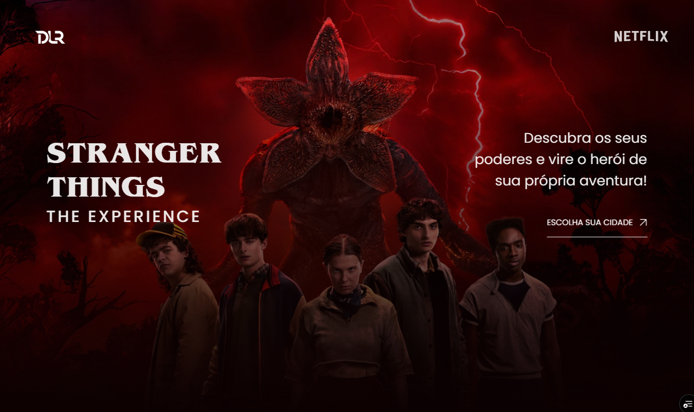

# 👾 Stranger Things — Dev Art Edition

## 📖 Sobre o Projeto

Este projeto é uma **releitura criativa do site oficial da série Stranger Things**, desenvolvido durante o **evento Dev Art**, idealizado por **Gustavo Campelo**.

A proposta foi recriar a experiência visual da série utilizando **HTML, CSS e JavaScript**, explorando animações modernas e interações imersivas, mantendo a identidade sombria e nostálgica característica do universo Stranger Things.

Todo o desenvolvimento foi realizado a partir de um **layout criado no Figma**, respeitando conceitos de design, movimento e experiência do usuário.

No site, foram implementados diversos efeitos visuais, como:
- Parallax scrolling
- Scroll smoother
- Animações fluidas e transições cinematográficas

O foco principal do projeto foi unir **design + código + animação**, transformando o layout estático em uma experiência viva na web.

## 🚀 Tecnologias Utilizadas

- **HTML5** — Estrutura semântica do site  
- **CSS3** — Estilização avançada e efeitos visuais  
- **JavaScript** — Lógica, interações e controle das animações  
- **GSAP (GreenSock Animation Platform)** — Animações, parallax e scroll effects  
- **Figma** — Criação e referência do layout  

## 🌐 Deploy

O projeto está disponível online no link abaixo:

🔗 **https://strangerthings.dlrdev.com.br/**

Hospedagem realizada utilizando:
- **Vercel**
- **GitHub**

## 🧪 Status do Projeto

✅ Concluído  
🎨 Projeto experimental e artístico  

---

🧩 Desenvolvido como parte do **Dev Art**, unindo criatividade, animação e desenvolvimento front-end.
